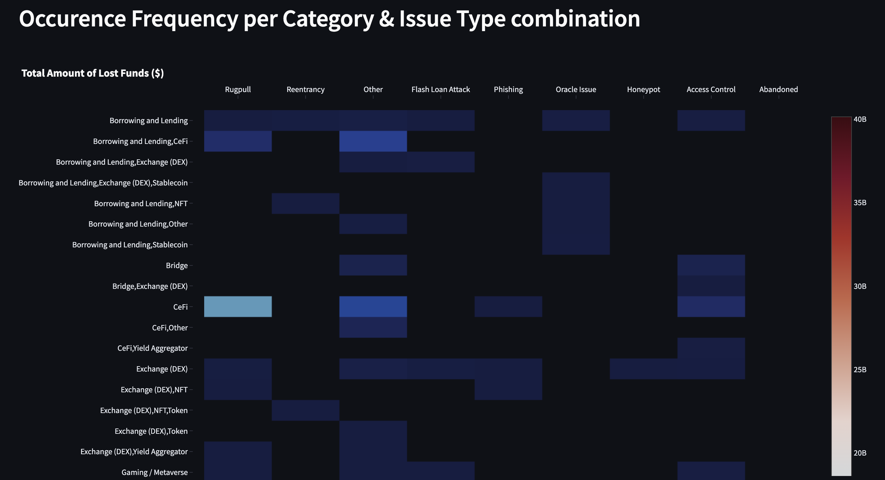

# DeFiYield
GitHub Source Link: https://github.com/kaankork/defiyield

## Task
Here is our Rect Database: https://defiyield.app/rekt-database
https://docs.defiyield.app/audits/rekt-database

Task: 
-  prepare the visualization of risk vectors and how it evolves over time?
- Share a jupyter notebook (or equivalent) in case of this task.

## Learnings
### Risk Vectors 
(link)[https://www.coindesk.com/layer2/2022/02/03/the-five-big-risk-vectors-of-defi/]

Risk dimensions in DeFi products remain understudied. 

Challenges
- doesn't conform with traditional risk management theory (volatility , value-at-risk etc.) in financial instruments
- smart contracts replaces intermediaries with automated financial technology but also introduces new risk vectors
- centralized -> in traditional risk management theory; banks, regulators play a role in de-risking macro factors.
- decentralized -> introduces new risk elements
- it is likely that DeFi will require a native risk management models that encompass the native protocol, infrastructure and market risks of the sector.

(link)[https://help.coinbase.com/en/coinbase/trading-and-funding/advanced-trade/defi-investment-risks]

### Types of Risk Vectors
1. **Instrinsic Protocol Risk** - risk mechanics embedded by default in the design of a protocol
2. **Exogenous Protocol Risk** - exogenous factors that alter the protocol’s expected behavior. Attacks exploiting the underlying mechanics of a DeFi protocol such as *oracle manipulations, flash loan exploits or attacks* that take advantage of bugs in the smart contract logic are prominent examples of this category. 
3. **Governance Risks** - governance proposals that alter weights in AMM pools or collateralization ratios in lending protocols typically help liquidity flow in or out of the protocol - important for investors. / DeFi could benefit from more robust governance models. 
4. **Underlying Blockchain Risk** - Compromising aspects such as the consensus mechanisms on a specific blockchains can materialize into vulnerabilities on DeFi protocols running on that platform. 
5. **Market Risk** - Example 1) investments in non-stablecoin AMM pools are vulnerable to loss if the price of the assets diverges drastically from the time when the liquidity was supplied to the pool. Example 2) abrupt crashes in the price of an asset that could trigger the massive removal of liquidity from a pool, causing major levels of slippage.

### (DeFiYield REKT Database)[https://defiyield.app/rekt-database]

**Category**
- Borrowing and Lending (63)
- Bridge (12)
- CeFi (137)
- Exchange (DEX) (144)
- Gaming / Metaverse (21)
- NFT (33)
- Other (57)
- Stablecoin (23)
- Token (1929)
- Unclassified (766)
- Yield Aggregator (42)

**Type of Issue**
1. Exit Scam
   1. Abandoned
   2. Honeypot
   3. Rugpull
   4. Other
2. Exploit
   1. Access control
   2. Phishing
   3. Flash Loan Attack
   4. Reentrancy
   5. Oracle Issue
   6. Other

## Ideas for Visualization
- How does each category (Bridge, CeFi, NFT, Token etc.) evolve over time? 

- How does each issue type (Abandoned, Rugpull, Phishing etc.) evolve over time? 

- Which issue types tend to be more frequent for each category? 

